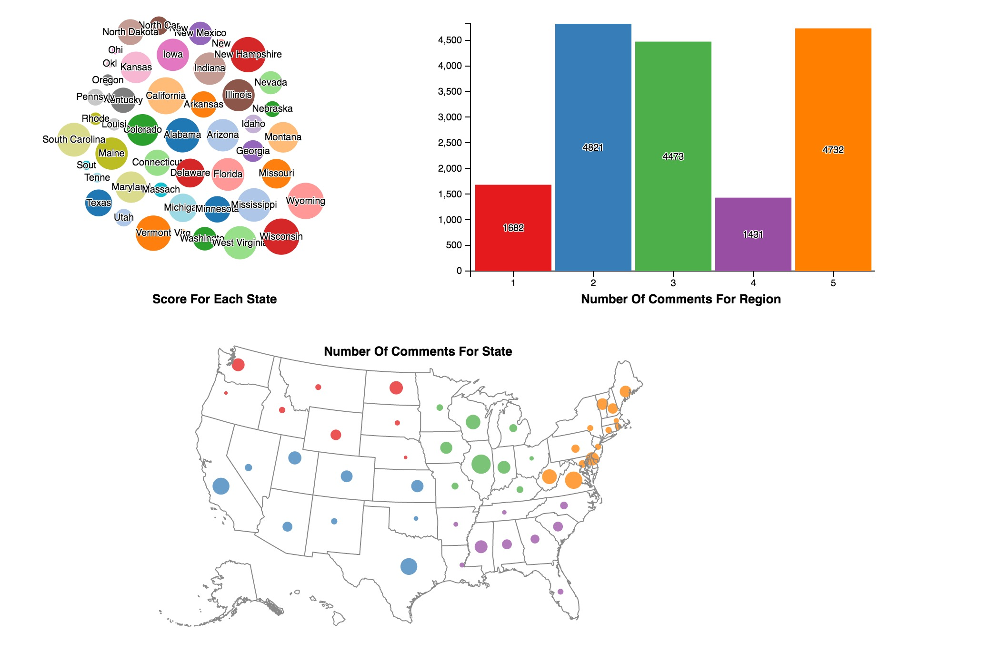
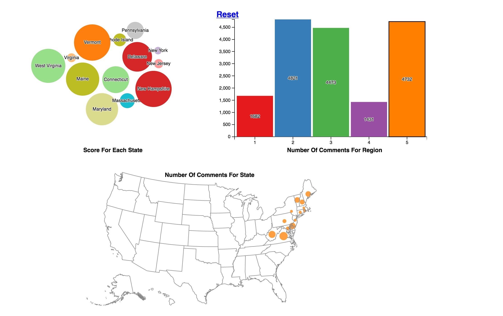
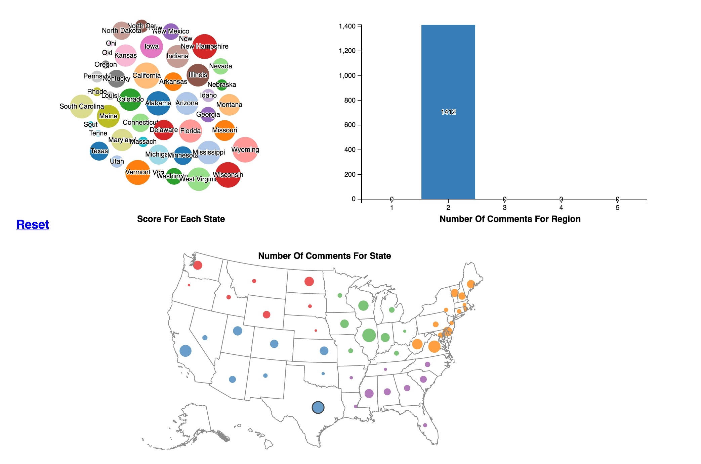

Visualizing Scores And Comments For Each US State
===

Visualization
---

Live demo at [Demo Link](https://nieqianchao.github.io/US_States_Visualization/).

Visualized data for each US state's score and comments. Got the data from this [website](http://bl.ocks.org/dukevis/6768900).

There are three views in the visualization. The first contain pack nodes for states with their scores. The second is a bar chart. For each region, this view shows the total comments for it. The last view is a US map view, it locates each state's number of comments to its geographical location.

The following screenshot shows all these views with all states' data. 
Once you click one of region bar or text from the second view, the first view and the third view will filter out states that not in this specific region. Following screenshot is one example. And also when you choose one specific state from view 1 or view 3, the second view will show how many comments for this state's region. Follwing screent shot is one example.  For each view, there is a buttion "Reset" to reset the cancel the filting data on this view, and other views will back to origin if they have changed.

Technical achievements
---

* The visualization using Crossfilter to group, filter, and aggregate data.

* Making use of d3-dispatch to seperate concerns with loosely-coupled code.

* Investigated how to apply dataset that contain the longitude and latitude value to combine other dimension to the geographical location.

Design achievements
---

* Size of pack nodes and circles on map present the number of score and comments for each US state.

* Histogram bins showes the sum of comments of states that from same region.

* Axis labels are included for number of comments from same region and its scale and tick change with the number in realtime.

* Reset buttion were added to cancel the data filtering and make the visualization back to original status.

* From the view3, define the same region states have the same color and the color is as same as view2 as well.

